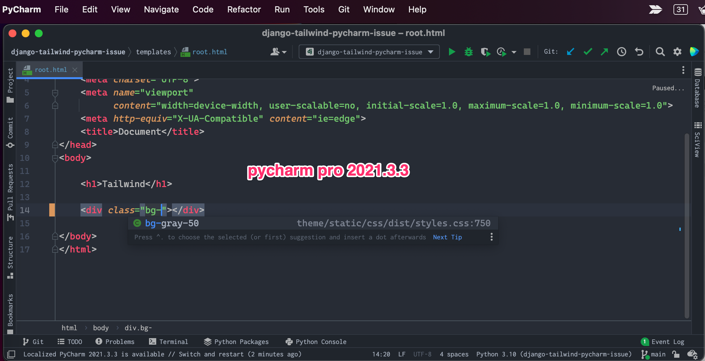
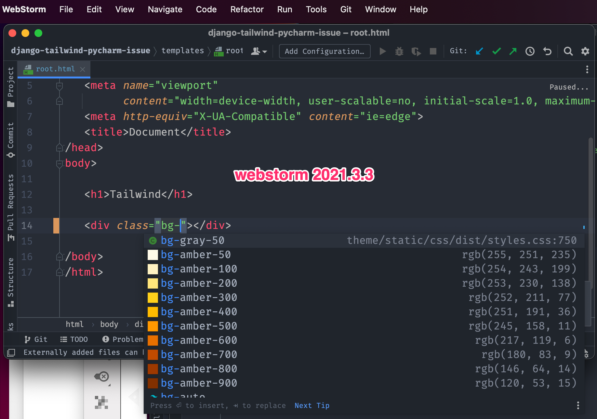

# Django Project

This is django project to reproduce the issue below.

* Tailwind CSS code completion doesn't work if package.json, node_modules, and tailwind.config.js is in a subfolder : https://youtrack.jetbrains.com/issue/WEB-48964

## Order of reproduction

1. Check Application in PC
   1. PyCharm Professional 2021.3.3
   2. WebStorm 2021.3.3.
   3. Python 3.8+
   4. Nodejs 16+
2. Install Tailwind CSS Plugin in PyCharm/WebStorm.
3. Type command in project

```shell
# clone project this project
git clone git@github.com:allieus/django-tailwind-pycharm-issue.git
cd django-tailwind-pycharm-issue

# create virtualenv
python -m venv venv

# activate virtualenv
source ./venv/bin/activate  # mac/linux
# venv\Scripts\activate  # windows

# install python packages
python -m pip install -r requirements.txt

# install npm packages
python manage.py tailwind install

# run tailwind builder
python manage.py tailwind start
```

4. Edit `templates/root.html` in PyCharm 2021.3.3 and WebStorm 2021.3.3.





---

Thanks for Awesome JetBrains tools.
